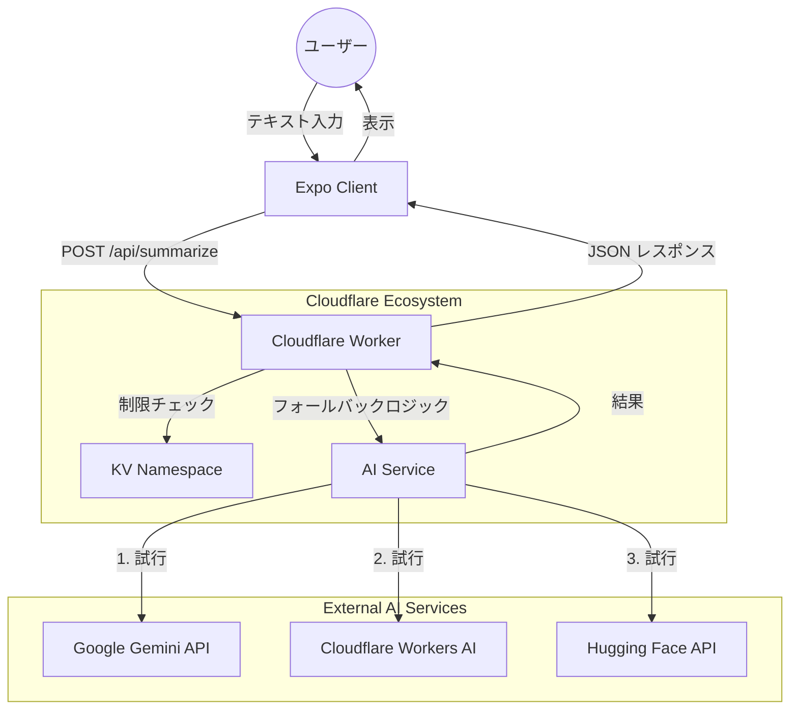
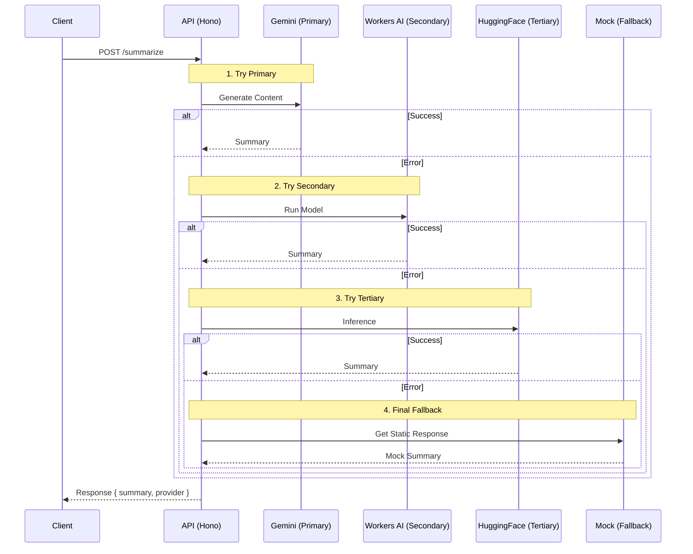
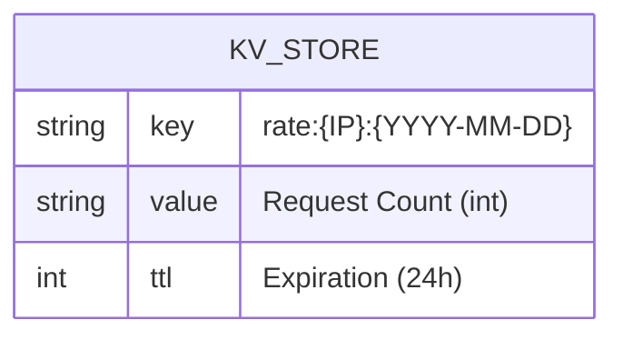

# システムアーキテクチャ

## 概要
X-Snack は、AI を使用して X（旧 Twitter）風のテキスト要約を提供するクロスプラットフォームアプリケーション（Web/モバイル）です。React Native (Expo) クライアントと Cloudflare Workers API (Hono) で構成されています。

## アーキテクチャ可視化

### システムコンテキスト



### AIフォールバックフロー (Sequence)

高可用性を確保するためのマルチプロバイダーフォールバック戦略です。



### データモデル (Cloudflare KV)

レート制限のために単純な Key-Value 構造を使用しています。



## 主要コンポーネント

### 1. Client (`apps/client`)
- **フレームワーク**: Expo SDK (React Native)
- **プラットフォーム**: Web (本番), iOS/Android (計画中)
- **UI ライブラリ**: React Native Paper / Custom UI
- **状態管理**: React Hooks / Context

### 2. API (`apps/api`)
- **ランタイム**: Cloudflare Workers
- **フレームワーク**: Hono (超高速 Web フレームワーク)
- **言語**: TypeScript

### 3. Services
- **ストレージ**: Cloudflare KV (レート制限用)
- **AI プロバイダー**:
  - Primary: Gemini 2.5 Flash Lite (Google)
  - Secondary: Cloudflare Workers AI
  - Tertiary: Hugging Face Inference API

## 主要な意思決定 (ADR Summary)

### 1. モノレポ構造
`pnpm workspace` を使用して、クライアントと API を単一のリポジトリで管理しています。
- 共有型 (`packages/types`) による型安全性。
- 統一された Lint/Format ルール (Biome)。

### 2. マルチプロバイダー AI フォールバック
高可用性とゼロコストを実現するために、Gemini (Google) -> Workers AI (Cloudflare) -> Hugging Face -> Mock の順でフォールバックします。

### 3. KV によるレート制限
Cloudflare KV を使用して IP アドレスごとの使用状況を追跡し、1日あたりのコストと負荷を制御します。

## ディレクトリ構造
```
/
├── apps/
│   ├── api/            # Hono API Worker
│   └── client/         # Expo React Native App
├── packages/
│   └── types/          # 共有 TypeScript 定義
├── docs/               # プロジェクトドキュメント
└── .github/            # CI/CD ワークフロー
```
