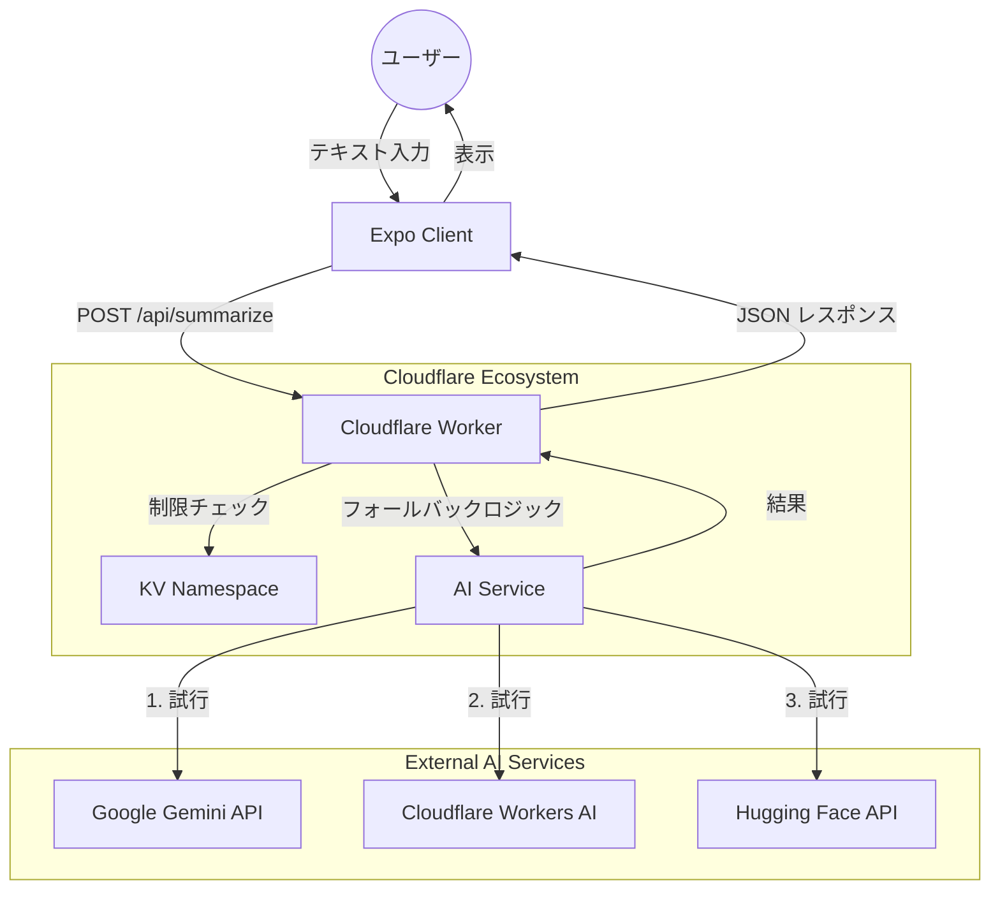

# アーキテクチャ概要

## システムコンテキスト図

### ハイレベルデータフロー

## 主要な意思決定

### 1. モノレポ構造
`pnpm workspace` を使用して、クライアントと API を単一のリポジトリで管理しています。これにより以下が可能になります：
- 共有型 (`packages/types`) によるネットワーク境界全体での型安全性の確保。
- 統一された Lint/Format ルール (Biome)。
- フロントエンドとバックエンドにまたがる機能のアトミックなコミット。

### 2. マルチプロバイダー AI フォールバック
高可用性とゼロコストを実現するために：
- **Gemini 2.5 Flash Lite**: 高速、高品質、寛大な無料枠 (60 RPM)。
- **Workers AI**: Cloudflare に組み込み。小型モデルは実質無料。
- **Hugging Face**: バックアップとしての無料推論 API。
- **Mock**: アプリが決してクラッシュしないようにするための最終手段。

### 3. KV によるレート制限
Cloudflare KV を使用して、IP アドレスごとの使用状況を追跡します。
- キー: `rate:{ip}:{date}`
- TTL: 24時間
- 制限: 1日あたり 3 リクエスト (厳格なコスト管理)
